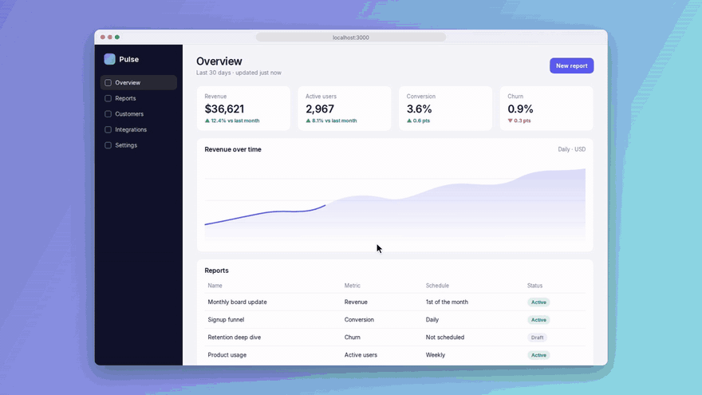

<div align="center">

# democast

**Write a script. Get a polished demo video of your web app.**<br>
Re-run it whenever your UI changes.



<sub>☝️ This video was made by democast from a short script. No screen recorder, no editing.</sub>

</div>

---

Recording a product demo by hand is slow: you click through your app, flub a step, start over, then spend an hour zooming and trimming in an editor. Next week the UI changes and the video is out of date.

**democast** turns the demo into code. You describe the steps; it drives a real browser and renders a video with:

- 🔍 **Auto-zoom** that follows the action, then eases back out
- 🖱️ **Smooth cursor** that glides between clicks, with click ripples
- ⌨️ **Natural typing**, letter by letter
- 💬 **Captions** that explain each step (`say: Invite your team`)
- 🎨 **Beautiful framing**: a gradient background, browser window and soft shadow
- 🔁 **Reproducible output**: change your UI, re-run, get a fresh video

## Quick start

```bash
npx democast init              # creates demo.yml
npx democast check demo.yml    # runs every step in seconds to make sure it works
npx democast record demo.yml   # makes the video
```

That's it — you get `demo.mp4` (and `demo.gif` if you ask for one).

> Requires Node 18+. Nothing else to install: democast brings its own ffmpeg, and downloads its browser automatically the first time it runs.

## Writing a script

```yaml
url: http://localhost:3000
displayUrl: myapp.com          # what the fake address bar shows
hide: [".cookie-banner", "#intercom"]   # keep these out of the video

output:
  file: demo.mp4
  gif: true
  background: aurora

steps:
  - say: Sign in with your email
  - click: Sign in
  - type: { into: Email, text: ada@example.com }
  - press: Enter
  - waitFor: Dashboard
  - say: Create a project in one click
  - click: New project
  - scroll: 400
```

### Pointing at things

Write targets the way you'd describe them to a person: **button or link text, a field's label or placeholder, or any visible text**. CSS selectors (`#submit`, `.card > button`) work too.

When several things match, democast picks the best one:

1. **Exact matches beat partial ones.** `click: Save` prefers a "Save" button over "Save changes" or "Saved items".
2. **Buttons and links beat form fields, which beat plain text.** A "Save" button wins over a heading that says "Save time".
3. If it's still ambiguous, it uses the first one on the page **and warns you**, so you can be more specific:

```yaml
- click: { text: Save, in: Settings }   # the Save nearest to "Settings"
- click: { text: Save, in: "#billing" } # the Save inside #billing
- click: { text: Save, nth: 2 }         # the second Save on the page
```

### Steps

| Step | Example | What it does |
| --- | --- | --- |
| `click` | `click: Save` | Moves the cursor to the element and clicks it |
| `type` | `type: hello` | Types into whatever is focused |
| `type` | `type: { into: Email, text: a@b.co }` | Clicks a field, then types into it |
| `say` | `say: Invite your team` | Shows a caption until the next `say` (`say: ""` clears it) |
| `say` | `say: { text: Ta-da!, for: 2s }` | Shows a caption for a fixed time |
| `press` | `press: Enter` | Presses a key (`Enter`, `Tab`, `Meta+K`, …) |
| `hover` | `hover: Pricing` | Moves the cursor over an element |
| `scroll` | `scroll: 600` | Smoothly scrolls the page by N pixels |
| `wait` | `wait: 1.5s` | Pauses (`500ms`, `2s`) |
| `waitFor` | `waitFor: Dashboard` | Waits (up to 30s) until something appears, e.g. after a slow load |
| `goto` | `goto: /settings` | Navigates to another page |

### Options

| Key | Default | |
| --- | --- | --- |
| `viewport` | `{ width: 1280, height: 800 }` | Browser size |
| `hide` | `[]` | CSS selectors to hide while recording (cookie banners, chat widgets) |
| `output.file` | `demo.mp4` | Where to write the video |
| `output.gif` | `false` | Also write a GIF (great for READMEs) |
| `output.fps` | `30` | Frame rate |
| `output.width` / `height` | `1920` / `1080` | Video size |
| `output.background` | `aurora` | `aurora`, `sunset`, `ocean`, `candy`, `forest`, `midnight`, `mono`, or any CSS color |

### CLI

```bash
democast check demo.yml             # dry run: checks every step works, in seconds
democast record demo.yml            # record and render
democast record demo.yml -o out.mp4 # choose output file
democast record demo.yml --gif      # also export a GIF
democast record demo.yml --headed   # watch the browser while it records
democast init                       # create a starter script
```

## Try the example

```bash
git clone https://github.com/vipul080/democast && cd democast
npm install
npm run demo   # renders examples/todo/demo.mp4
```

## How it works

1. **Record** — Playwright drives Chromium through your steps while the page is captured frame-by-frame at 2× resolution. Every cursor move, click and keystroke is logged on a timeline.
2. **Direct** — a virtual camera reads the timeline and decides where to look: it zooms toward whatever is being clicked or typed into and eases back out when things go quiet, using spring physics so motion never feels robotic.
3. **Render** — each output frame is composited (background, window, zoomed page, cursor, click effects) and streamed into ffmpeg.

## Roadmap

- [x] Captions (`say: Now invite your team`)
- [x] Smart element matching with `in:` / `nth:`
- [x] `democast check` dry runs
- [ ] Use in CI: GitHub Action that regenerates demo videos on every release
- [ ] Dark-mode window theme and custom window styles
- [ ] Mobile viewports with device frames
- [ ] Record terminal sessions alongside the browser
- [ ] Background music and fade in/out

Have an idea? [Open an issue](../../issues) — feature requests are very welcome.

## Contributing

PRs are welcome! To work on democast locally:

```bash
npm install
npx playwright install chromium
npm test            # unit + browser tests
npm run demo        # run the example with your changes
```

## License

MIT
